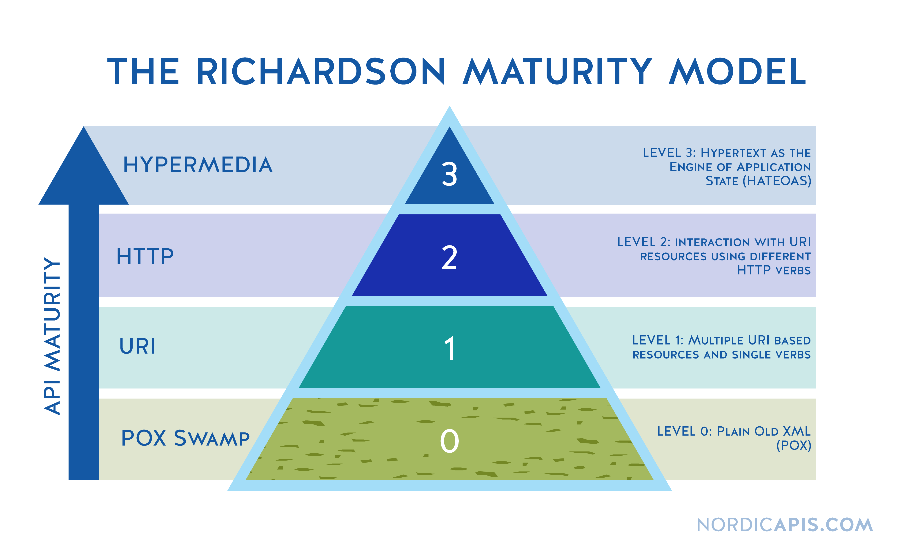

# REpresentational State Transfer (REST)

We will focus our discussion on REST. Especially on how to achieve a more RESTful web API, by leveraging the capabilities of HTTP. For more information about REST itself, please refer to the [Wikipedia article on REST](http://en.wikipedia.org/wiki/Representational_state_transfer) or [What is REST?](<https://www.restapitutorial.com/lessons/whatisrest.html>).

Some of the aspects of designing RESTful web APIs include:

- *[Unique identification](resource_identifiers)* of resources by using URIs.
- Operation on resources by using the available *[HTTP methods](methods)*.
- A choice of *[formats and media types](representations/#format-and-a-media-type)* that allow clients to specify representation formats they can render, and for servers to honor those (or indicate if it cannot).
- *[Linking](hypermedia)* between resources to indicate relationships (e.g., hypermedia links).

!!! note "Why REST?"
    REST imposes architectural constraints on your API design, but instead of regarding them as limitations, see them as support for building great APIs, i.e. APIs that are simple, clear, clean and approachable.

## Richardson Maturity Model

Today, most web APIs are not truly RESTful APIs, instead they tend to be of a varying degree of RESTful. Therefore, the [Richardson Maturity Model](http://martinfowler.com/articles/richardsonMaturityModel.html) is often used to describe what it takes to make a well-designed RESTful API:

- **Level 0**: Uses HTTP as a transport mechanism for RPC.
- **Level 1**: Uses URIs for individual resources, but does not use HTTP methods, media types, or linking between resources.
- **Level 2**: Uses HTTP methods and headers for interactions with resources, and returns appropriate HTTP status codes.
- **Level 3**: Uses hypermedia controls for discoverability, which also helps making an API more self-documenting.

!!! tip "So a good RESTful API should"
    - Use unique URIs to expose resources for clients to use.
    - Use the full spectrum of HTTP, to perform operations on those resources, and allow different representations of content.
    - Provide relational links for resources, to inform the client what can be done next.

## What's in the Box?

In these guidelines we will offer advise on how to achieve this, when implementing clients as well as servers. Specifically we will focus on:

- How to identify resources by using URIs
- How to use the available HTTP methods
- What representation formats to you expose and what to do when the server cannot fulfill a request for a given representation
- How to report errors, using HTTP status codes and representations
- How to handle security, including HTTP authentication, OAuth2, and API tokens
- How to handle hypermedia linking
- How to document your API

{>>Anything else?<<}

## Before we get Started

Because REST is an architectural style and not a strict standard, it allows for a lot of flexibly. So before jumping straight into designing an API, it can be helpful to think about:

- the target audience, i.e. customers, third-party services, or other developers looking to take advantage of your services for their own customers.
- ease of life for the consuming developers
- use cases
- technologies used
- products/services to expose
- other services to interact with

As long as the API only has one consumer, one could argue that it's entire job is to service that consumer. 

!!! tip "Make it RESTful, but be pragmatic!"
    Aiming at a level above 2, according to Richardson's Maturity Model, may simply be impractical.